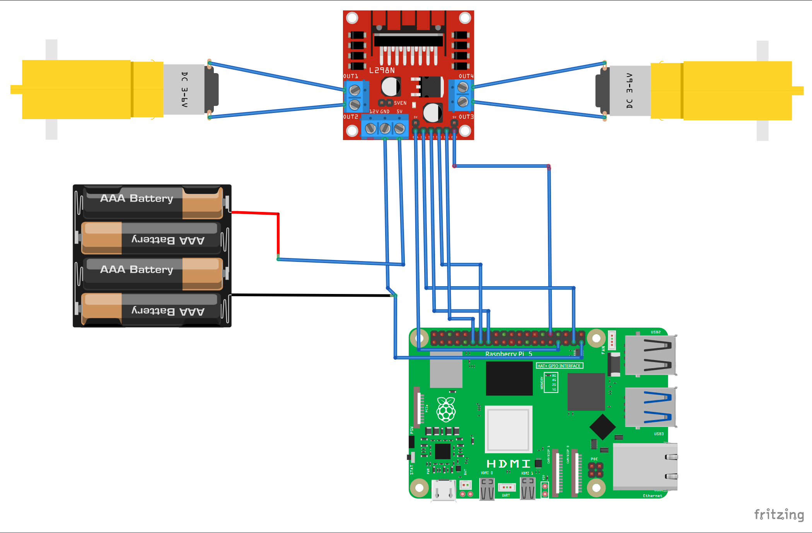

# Robot Control Project

## Project Description

This project implements a WiFi-controlled robot powered by a Raspberry Pi. The robot uses a dual-motor system controlled through GPIO pins via a motor driver module. The system consists of:

- **Server (pi.py)**: A Flask web application running on the Raspberry Pi that receives movement commands and controls the robot's motors
- **Client (robot_control.py)**: A command-line interface for controlling the robot from any computer on the same network

The robot supports four directional movements (forward, backward, left, right) and can be stopped remotely. Commands are sent via HTTP POST requests from the client to the Raspberry Pi server.

## Schematics

Circuit diagram showing the connections between the Raspberry Pi, motor driver module, motors, and batteries:



**Component List:**

| Component | Qty | Datasheet |
|-----------|-----|-----------|
| DC Motor | 2 | [TA0132 Specifications](https://www.auselectronicsdirect.com.au/assets/files/TA0132%20Specifications.pdf) |
| L298N Motor Driver | 1 | [L298N Motor Driver](https://www.handsontec.com/dataspecs/L298N%20Motor%20Driver.pdf) |
| Raspberry Pi 5 | 1 | [Raspberry Pi 5 Product Brief](https://pip-assets.raspberrypi.com/categories/892-raspberry-pi-5/documents/RP-008348-DS-6-raspberry-pi-5-product-brief.pdf?disposition=inline) |
| AAA Battery Holder | 1 | [AAA Battery Holder](https://www.emag.ro/suport-4-baterii-aa-cu-comutator-r6-6v-negru-rosu-2-a-003/pd/D4YGKLMBM/) |
| Connecting Wires | Various | - |

**Pin Configuration:**
- Motor A: Forward (GPIO 26), Backward (GPIO 22)
- Motor B: Forward (GPIO 27), Backward (GPIO 17)
- Enable Pin A (ENA): GPIO 12 (PWM)
- Enable Pin B (ENB): GPIO 13 (PWM)

## Pre-requisites

To run this project, ensure you have the following installed:

- **Python 3.7+** on the Raspberry Pi and control computer
- **gpiozero** library (for GPIO control on Raspberry Pi)
  ```bash
  pip install gpiozero
  ```
- **Flask** (for the server on Raspberry Pi)
  ```bash
  pip install flask
  ```
- **requests** (for the client to send HTTP requests)
  ```bash
  pip install requests
  ```
- Hardware: Raspberry Pi 5, L298N motor driver, 2 DC motors, batteries, and connecting wires

## Setup and Build

### 1. Prepare the Raspberry Pi

1. Assemble the hardware according to the schematics above
2. Install Python 3.7+
3. Install required Python packages:
   ```bash
   pip install gpiozero flask
   ```

### 2. Setup the Server

1. Copy `pi.py` to your Raspberry Pi
2. Ensure the GPIO pins match your circuit connections:
   - GPIO 12 and 13 for PWM enable pins
   - GPIO 26, 22, 27, 17 for motor control pins
3. The Flask server will automatically start on `0.0.0.0:5000`

### 3. Setup the Client

1. Copy `robot_control.py` to your control computer
2. Install the requests library:
   ```bash
   pip install requests
   ```
3. Update the `MOVE_URL` in the script to match your Raspberry Pi's IP address:
   ```python
   MOVE_URL = 'http://<YOUR_PI_IP>:5000/move'
   ```

## Running

### Step 1: Start the Server on Raspberry Pi

Run the Flask server on your Raspberry Pi:

```bash
python pi.py
```

You should see output indicating the Flask server is running on `0.0.0.0:5000`.

### Step 2: Run the Client Controller

On your control computer, run the client script:

```bash
python robot_control.py
```

### Step 3: Send Commands

Once the client is running, enter commands at the prompt. Available commands:

| Command | Action |
|---------|--------|
| `w` | Move forward |
| `a` | Turn left |
| `s` | Move backward |
| `d` | Turn right |
| `stop` | Stop all motion |
| `esc` | Stop robot and exit the program |

Example session:
```
Control your robot with WASD keys. Press ESC to stop and exit.
Enter command (w/a/s/d/stop): w
Sent command: w
Enter command (w/a/s/d/stop): a
Sent command: a
Enter command (w/a/s/d/stop): esc
Stopping robot. Exiting.
```